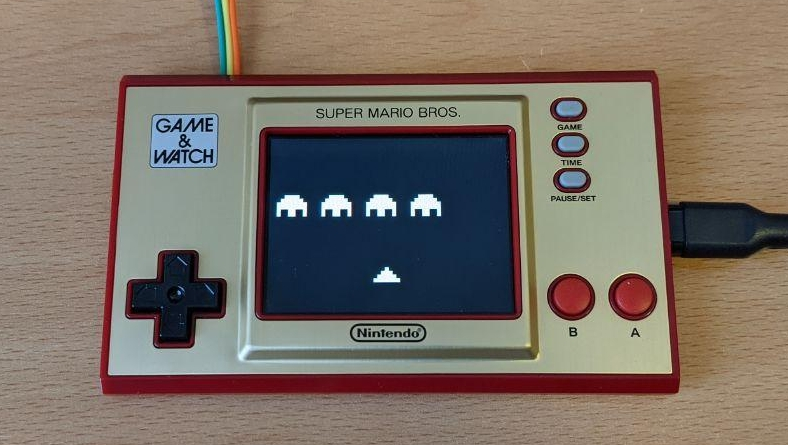

# chip8swemu-gaw

*CHIP-8 and Super-CHIP emulator for the Game & Watch.*

This is a quick and dirty port of [chip8swemu](https://github.com/AlfonsoJLuna/chip8swemu) for the [Game & Watch: Super Mario Bros.](https://en.wikipedia.org/wiki/Game_%26_Watch:_Super_Mario_Bros.)

See it in action: https://www.youtube.com/watch?v=n2IKZFr6tSo

## How to use

### Prerequisites

Follow [this guide](https://github.com/ghidraninja/game-and-watch-backup) to install the required packages and prepare your device.

### Adding games

Games are stored in the `source/games.h` file. The file already includes some public domain or freely distributed games that can be used for testing the emulator or as an example for adding more games.

If you are looking for more games to test, the [Chip8 Community Archive](https://github.com/JohnEarnest/chip8Archive) includes a selection of modern games released under the Creative Commons 0 "No Rights Reserved" license. For an older selection of freely distributed games you can also check the [Chip-8 Program Pack](https://github.com/dbousamra/scala-js-chip8/tree/master/src/resources/Chip-8%20Pack) by Revival Studios.

Currently, the process of adding new games is done manually. You can convert your games from binary format to a C array using `xxd -i game.ch8` and then you need to manually add them to the `games.h` file. For each game you also need to specify the CPU frequency and the key mapping. This process may be automated in the future.

### Building

1. Open a terminal in the root folder of the repository.
2. Type `make` for building.
3. Type `make flash` for flashing the binary into your device.
